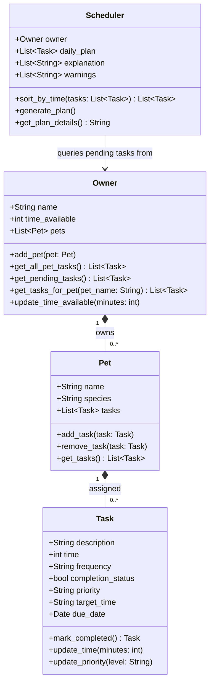

# Final PawPal+ System Architecture

```mermaid
classDiagram
    class Owner {
        +String name
        +int time_available
        +List~Pet~ pets
        +add_pet(pet: Pet)
        +get_all_pet_tasks() List~Task~
        +get_pending_tasks() List~Task~
        +get_tasks_for_pet(pet_name: String) List~Task~
        +update_time_available(minutes: int)
    }

    class Pet {
        +String name
        +String species
        +List~Task~ tasks
        +add_task(task: Task)
        +remove_task(task: Task)
        +get_tasks() List~Task~
    }

    class Task {
        +String description
        +int time
        +String frequency
        +bool completion_status
        +String priority
        +String target_time
        +Date due_date
        +mark_completed() Task
        +update_time(minutes: int)
        +update_priority(level: String)
    }

    class Scheduler {
        +Owner owner
        +List~Task~ daily_plan
        +List~String~ explanation
        +List~String~ warnings
        +sort_by_time(tasks: List~Task~) List~Task~
        +generate_plan()
        +get_plan_details() String
    }

    Owner "1" *-- "0..*" Pet : owns
    Pet "1" *-- "0..*" Task : assigned
    Scheduler --> Owner : queries pending tasks from
```
